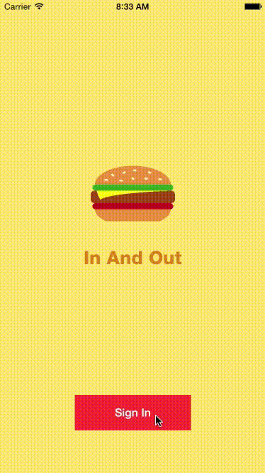

<p align="center">
  
</p>

#In And Out

**iOS demo app for signing in and signing out**



##Key points

###Manage sign in out state with a class

This class has three methods.
- Check the current state
- Change the state to 'Signed In'
- Change the state to 'Signed Out'

```swift

//  AuthManager.swift
//  InAndOut

import Foundation

class AuthManager {
    private static var userDefaults = NSUserDefaults.standardUserDefaults()
    private static let signInKey = "SIGNIN"

    class func isSignedIn() -> Bool {
        return userDefaults.boolForKey(signInKey)
    }

    class func signIn() {
        userDefaults.setBool(true, forKey: signInKey)
    }

    class func signOut() {
        userDefaults.setBool(false, forKey: signInKey)
    }
}

```

This app uses NSUserDefaults to save the status. But in many cases, it is recommanded to use [iOS Keychain Services](https://developer.apple.com/library/mac/documentation/Security/Conceptual/keychainServConcepts/iPhoneTasks/iPhoneTasks.html) to keep important data.
> Why not check this awesome iOS Keychain wrapper project? [Locksmith](https://github.com/matthewpalmer/Locksmith)

###Check initial view controller

When the app is launched following method is executed while showing splash view on the screen.

```swift

//  AppDelegate.swift
//  InAndOut

func application(application: UIApplication, didFinishLaunchingWithOptions launchOptions: [NSObject: AnyObject]?) -> Bool {
    if !AuthManager.isSignedIn() {
        window?.rootViewController = storyboard.instantiateViewControllerWithIdentifier("SignInViewController") as! SignInViewController
    }

    return true
}

```

> In Storyboard, main view controller is set to Initial View Controller and sign in view controller's Storyboard identifier is "SignInViewController".

This method check the status and change the rootViewController property of window object. Therefore depending on the status initial view controller shown right after splash screen can be chosen in right timing.

###Signing out

Signing out is very easy. Just change the status to signed out and set the rootViewController.

```swift

//  MainViewController.swift
//  InAndOut

@IBAction func trySignOut() {
    AuthManager.signOut()
    (UIApplication.sharedApplication().delegate as! AppDelegate).window?.rootViewController = storyboard?.instantiateViewControllerWithIdentifier("SignInViewController") as! SignInViewController
}

```

##Feedback
You can clone this project and build it on your own!
If you have any other ideas and something to talk on this project feel free to contact me.

Jason Nam<br>[Website](http://www.jasonnam.com)<br>[Email](mailto:contact@jasonnam.com)
